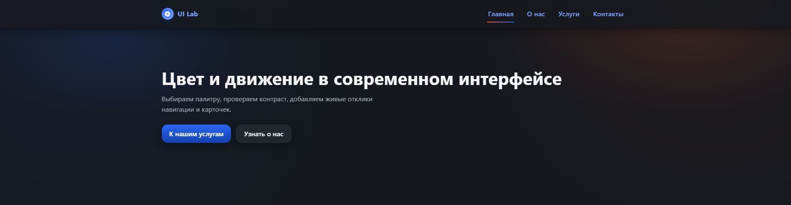

# Практика: Цвет и движение в современном интерфейсе

Цель — закрепить знания о роли цвета и микроанимаций в пользовательском интерфейсе и освоить приёмы их реализации средствами HTML и CSS.

---

## Задачи

1. **Навигация**
   - Сделано меню из 4 пунктов: **Главная, О нас, Услуги, Контакты**.
   - Добавлен хедер.

2. **Оформление**
   - Меню и структура страницы стилизованы с помощью CSS.
   - Использованы переменные для палитры и отступов.
   - Есть хедер, главный блок, карточки и футер.

3. **Цвет**
   - Основная палитра: синий `--primary`, акцент: коралловый `--accent`.
   - Контраст проверен — текст читается и в светлой, и в тёмной теме.

4. **Микроанимации**
   - **Hover:** плавная подсветка ссылок и кнопок.
   - **Появление при загрузке:** элементы заходят с задержкой через `@keyframes`.
   - **Подчеркивание и масштаб:** у навигации при наведении.
   - **Дополнительно:** карточки «пружинят» при hover, кнопки с ripple-эффектом.

---

## Что есть в проекте
- `index.html` — разметка со структурой и data-атрибутами для анимаций.  
- `style.css` — цвета, отступы, анимации, переходы.
- `cup.png` — картинка/заглушка для карточек.

---

## Как смотреть
1. Открыть `index.html` в браузере.  
2. Поймать появление меню, проверить наведение на пункты и карточки.

Или 🔗 [Открыть проект на GitHub Pages](https://stolzie071.github.io/Web_UI_PR3/)

---

## Автор
Ларюшкин Антон ТКМО-01-24
Практика №3 по теме «Цвет и движение в современном интерфейсе». 
